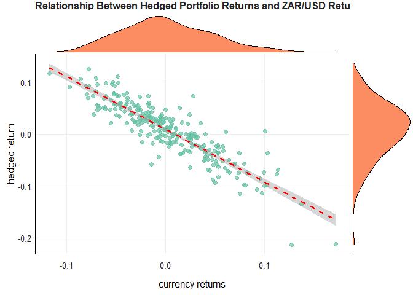

# Question 2

``` r
plot_portfolio_relationships(tidy_data, "hedged_return", "currency_returns")
```

<!-- -->

``` r
calculate_metrics(
  data = tidy_data,
  start_date = "2004-12-01",
  row_variables = c("hedged_return", "unhedged_return"),
  reference_variable = "$ZAR.USD"
)
```

| Tickers         | Correlation with \$ZAR.USD | Annual Return | Standard Deviation |
|:----------------|---------------------------:|--------------:|-------------------:|
| Hedged Return   |                 -0.1003131 |     0.0515608 |          0.1879226 |
| Unhedged Return |                 -0.1156581 |     0.0987796 |          0.0991014 |

Portfolio Metrics Comparison
