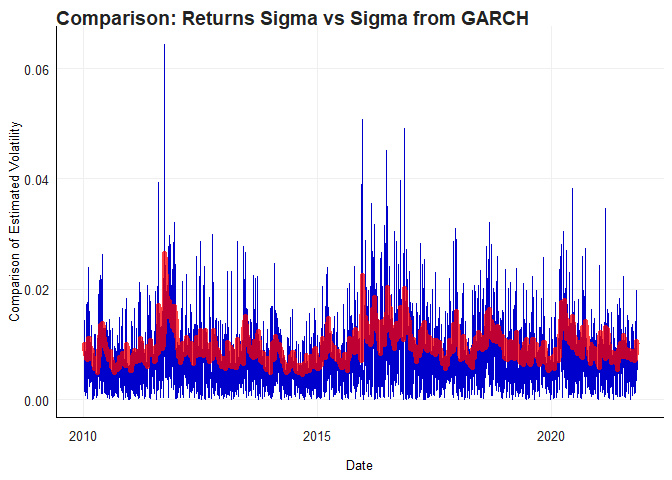
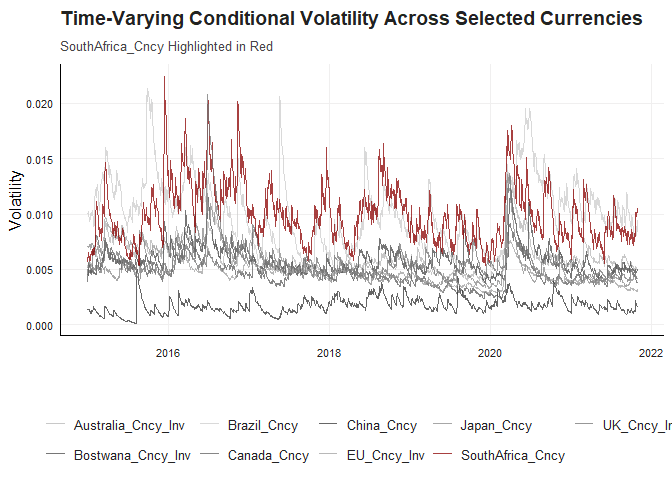
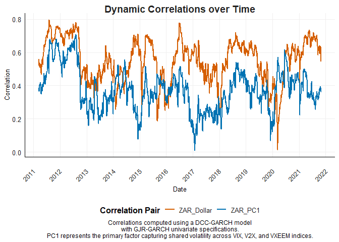

# Question 5: Volatility and Garch estimates

I have been asked to evaluate the following two statements

1.  The South African rand (ZAR) has over the past few years been one of
    the most volatile currencies

2.  The ZAR has generally performed well during periods where G10
    currency carry trades have been favourable and currency valuations
    relatively cheap. Globally, it has been one of the currencies that
    most benefit during periods where the Dollar is comparatively
    strong, indicating a risk-on sentiment.

This figure directly illustrates the core concept of GARCH models:
capturing time-varying volatility. By comparing the historical
volatility (Returns Sigma) with the GARCH-predicted volatility (Sigma
from GARCH), you can visually demonstrate:

Volatility Clustering: GARCH models are particularly adept at capturing
periods of high and low volatility, which are often clustered together.
Your figure can highlight these clusters. Model Fit: The closer the two
lines are, the better the GARCH model fits the data. Deviations between
the lines can indicate periods where the model under- or overestimates
volatility. Forecasting Power: If you’ve used the GARCH model to
generate forecasts, you can include future predictions on the plot. This
will show how well the model anticipates future volatility.

The graph confirms that the South African Rand is highly volatile
compared to other major currencies.

The graph partially supports the second statment. It shows that ZAR
correlates positively with the Dollar (which suggests ZAR benefits in
certain global conditions) and responds inversely to volatility. This
indicates that ZAR may perform well during periods when global markets
favour risk-taking, but it may not be straightforwardly linked to the
Dollar’s strength in all cases.
