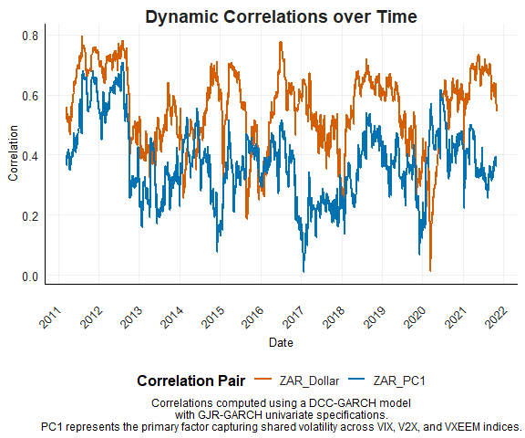

# Question 5: Volatility and Garch estimates

I have been asked to evaluate the following two statements

1.  The South African rand (ZAR) has over the past few years been one of
    the most volatile currencies

2.ˆ The ZAR has generally performed well during periods where G10
currency carry trades have been favourable and currency valuations
relatively cheap. Globally, it has been one of the currencies that most
benefit during periods where the Dollar is comparatively strong,
indicating a risk-on sentiment.

``` r
rm(list = ls()) # Clean your environment:
gc() # garbage collection - It can be useful to call gc after a large object has been removed, as this may prompt R to return memory to the operating system.
```

    ##          used (Mb) gc trigger (Mb) max used (Mb)
    ## Ncells 483491 25.9    1038174 55.5   686457 36.7
    ## Vcells 899259  6.9    8388608 64.0  1876680 14.4

``` r
source("code/install_and_load.R")
install_and_load(c("tidyverse","zoo","ggplot2","xts","treemap","PerformanceAnalytics","tbl2xts","rugarch","rmgarch","tidyr","scales"))
```

    ## Loading required package: tidyverse

    ## ── Attaching core tidyverse packages ──────────────────────── tidyverse 2.0.0 ──
    ## ✔ dplyr     1.1.4     ✔ readr     2.1.5
    ## ✔ forcats   1.0.0     ✔ stringr   1.5.1
    ## ✔ ggplot2   3.5.1     ✔ tibble    3.2.1
    ## ✔ lubridate 1.9.3     ✔ tidyr     1.3.1
    ## ✔ purrr     1.0.2     
    ## ── Conflicts ────────────────────────────────────────── tidyverse_conflicts() ──
    ## ✖ dplyr::filter() masks stats::filter()
    ## ✖ dplyr::lag()    masks stats::lag()
    ## ℹ Use the conflicted package (<http://conflicted.r-lib.org/>) to force all conflicts to become errors
    ## Loading required package: zoo
    ## 
    ## 
    ## Attaching package: 'zoo'
    ## 
    ## 
    ## The following objects are masked from 'package:base':
    ## 
    ##     as.Date, as.Date.numeric
    ## 
    ## 
    ## Loading required package: xts
    ## 
    ## 
    ## ######################### Warning from 'xts' package ##########################
    ## #                                                                             #
    ## # The dplyr lag() function breaks how base R's lag() function is supposed to  #
    ## # work, which breaks lag(my_xts). Calls to lag(my_xts) that you type or       #
    ## # source() into this session won't work correctly.                            #
    ## #                                                                             #
    ## # Use stats::lag() to make sure you're not using dplyr::lag(), or you can add #
    ## # conflictRules('dplyr', exclude = 'lag') to your .Rprofile to stop           #
    ## # dplyr from breaking base R's lag() function.                                #
    ## #                                                                             #
    ## # Code in packages is not affected. It's protected by R's namespace mechanism #
    ## # Set `options(xts.warn_dplyr_breaks_lag = FALSE)` to suppress this warning.  #
    ## #                                                                             #
    ## ###############################################################################
    ## 
    ## 
    ## Attaching package: 'xts'
    ## 
    ## 
    ## The following objects are masked from 'package:dplyr':
    ## 
    ##     first, last
    ## 
    ## 
    ## Loading required package: treemap

    ## Warning: package 'treemap' was built under R version 4.4.2

    ## Loading required package: PerformanceAnalytics
    ## 
    ## Attaching package: 'PerformanceAnalytics'
    ## 
    ## The following object is masked from 'package:graphics':
    ## 
    ##     legend
    ## 
    ## Loading required package: tbl2xts
    ## Loading required package: rugarch

    ## Warning: package 'rugarch' was built under R version 4.4.2

    ## Loading required package: parallel
    ## 
    ## Attaching package: 'rugarch'
    ## 
    ## The following object is masked from 'package:purrr':
    ## 
    ##     reduce
    ## 
    ## The following object is masked from 'package:stats':
    ## 
    ##     sigma
    ## 
    ## Loading required package: rmgarch

    ## Warning: package 'rmgarch' was built under R version 4.4.2

    ## 
    ## Attaching package: 'rmgarch'
    ## 
    ## The following objects are masked from 'package:xts':
    ## 
    ##     first, last
    ## 
    ## The following objects are masked from 'package:dplyr':
    ## 
    ##     first, last
    ## 
    ## Loading required package: scales
    ## 
    ## Attaching package: 'scales'
    ## 
    ## The following object is masked from 'package:purrr':
    ## 
    ##     discard
    ## 
    ## The following object is masked from 'package:readr':
    ## 
    ##     col_factor

``` r
list.files('code/', full.names = T, recursive = T) %>% .[grepl('.R', .)] %>% as.list() %>% walk(~source(.))


cncy <- read_rds("data/currencies.rds")
cncy_Carry <- read_rds("data/cncy_Carry.rds")
cncy_value <- read_rds("data/cncy_value.rds")
cncyIV <- read_rds("data/cncyIV.rds")
bbdxy <- read_rds("data/bbdxy.rds")
IV <- read_rds("data/IV.rds")
```

``` r
# Prepare data for -sigZAR, including log returns in the result
zar_data <- cncy %>%
  filter(Name == "SouthAfrica_Cncy") %>%
  arrange(date) %>%
  mutate(log_return = log(Price / lag(Price))) %>%
  drop_na() %>%
  mutate(Squared_Returns = log_return^2)

# Convert to time-series format for GARCH model
zar_xts <- tbl_xts(zar_data, cols_to_xts = "log_return", spread_by = "Name")
```

    ## The spread_by column only has one category. 
    ## Hence only the column name was changed...

``` r
# Fit GARCH model and extract conditional volatility
cond_vol_df <- fit_garch(zar_xts)


# Plot comparison
returns_df <- zar_data %>% select(date, Squared_Returns) %>% drop_na()
plot_volatility_comparison(returns_df, cond_vol_df, filter_date = "2010-01-01")
```

    ## Warning: Using `size` aesthetic for lines was deprecated in ggplot2 3.4.0.
    ## ℹ Please use `linewidth` instead.
    ## This warning is displayed once every 8 hours.
    ## Call `lifecycle::last_lifecycle_warnings()` to see where this warning was
    ## generated.


This figure directly illustrates the core concept of GARCH models:
capturing time-varying volatility. By comparing the historical
volatility (Returns Sigma) with the GARCH-predicted volatility (Sigma
from GARCH), you can visually demonstrate:

Volatility Clustering: GARCH models are particularly adept at capturing
periods of high and low volatility, which are often clustered together.
Your figure can highlight these clusters. Model Fit: The closer the two
lines are, the better the GARCH model fits the data. Deviations between
the lines can indicate periods where the model under- or overestimates
volatility. Forecasting Power: If you’ve used the GARCH model to
generate forecasts, you can include future predictions on the plot. This
will show how well the model anticipates future volatility.

``` r
# Define currencies
selected_currencies <- c(
  "SouthAfrica_Cncy", "Brazil_Cncy", "Australia_Cncy_Inv", "EU_Cncy_Inv", 
  "Japan_Cncy", "UK_Cncy_Inv", "Canada_Cncy", "Bostwana_Cncy_Inv", "China_Cncy"
)

# Fit GARCH for multiple currencies and pass to plotting funciton 
cncy %>% fit_garch_for_multiple_currencies( selected_currencies) %>% plot_volatility_across_currencies( highlight_currency = "SouthAfrica_Cncy", filter_date = "2015-01-01")
```

    ## The spread_by column only has one category. 
    ## Hence only the column name was changed...
    ## The spread_by column only has one category. 
    ## Hence only the column name was changed...
    ## The spread_by column only has one category. 
    ## Hence only the column name was changed...
    ## The spread_by column only has one category. 
    ## Hence only the column name was changed...
    ## The spread_by column only has one category. 
    ## Hence only the column name was changed...
    ## The spread_by column only has one category. 
    ## Hence only the column name was changed...
    ## The spread_by column only has one category. 
    ## Hence only the column name was changed...
    ## The spread_by column only has one category. 
    ## Hence only the column name was changed...
    ## The spread_by column only has one category. 
    ## Hence only the column name was changed...


``` r
# Calculate log returns for ZAR and Dollar
zar_data <- calculate_log_returns(cncy %>% filter(Name == "SouthAfrica_Cncy"))
dollar_data <- calculate_log_returns(bbdxy %>% filter(Name == "BBDXY"))

# Prepare PCA data
pc_data <- prepare_pca_data(IV %>% filter(Name %in% c("V2X", "VIX", "VXEEM")))

# Merge ZAR, Dollar, and PC1 data
merged_data <- zar_data %>%
  select(date, ZAR_log_return = log_return) %>%
  left_join(dollar_data %>% select(date, Dollar_log_return = log_return), by = "date") %>%
  left_join(pc_data %>% select(date, PC1), by = "date") %>%
  drop_na()

# Fit DCC-GARCH model
dcc_fit <- fit_dcc_garch(merged_data)

# Prepare data frames for plotting
volatility_df <- prepare_volatility_df(dcc_fit, merged_data$date)
correlation_df <- prepare_correlation_df(dcc_fit, merged_data$date)

plot_dynamic_correlations(correlation_df)
```



The graph partially supports the second statment. It shows that ZAR
correlates positively with the Dollar (which suggests ZAR benefits in
certain global conditions) and responds inversely to volatility. This
indicates that ZAR may perform well during periods when global markets
favour risk-taking, but it may not be straightforwardly linked to the
Dollar’s strength in all cases.

works

<!-- ```{r} -->
<!-- library(dplyr) -->
<!-- library(tidyr) -->
<!-- library(stats) -->
<!-- zar_data <- cncy %>% -->
<!--   filter(Name == "SouthAfrica_Cncy") %>% -->
<!--   arrange(date) %>% -->
<!--   mutate(log_return = log(Price / lag(Price))) %>% -->
<!--   drop_na() -->
<!-- # Step 3: Extract Dollar index data (BBDXY) -->
<!-- dollar_data <- bbdxy %>% -->
<!--   filter(Name == "BBDXY") %>% -->
<!--   arrange(date) %>% -->
<!--   mutate(log_return = log(Price / lag(Price))) %>% -->
<!--   drop_na() -->
<!-- # Compute log returns for volatility indices -->
<!-- pc_data <- IV %>% -->
<!--   filter(Name %in% c("V2X", "VIX", "VXEEM")) %>% -->
<!--   pivot_wider(names_from = Name, values_from = Price) %>% -->
<!--   mutate(across(starts_with("V"), ~ log(. / lag(.)))) %>% -->
<!--   drop_na() -->
<!-- # Perform PCA -->
<!-- pc_result <- prcomp(pc_data %>% select(starts_with("V")), scale. = TRUE) -->
<!-- # Extract PC1 -->
<!-- pc_data <- pc_data %>% -->
<!--   mutate(PC1 = predict(pc_result)[, 1]) -->
<!-- # Merge ZAR and Dollar log returns with PC1 -->
<!-- merged_data <- zar_data %>% -->
<!--   select(date, ZAR_log_return = log_return) %>% -->
<!--   left_join(dollar_data %>% select(date, Dollar_log_return = log_return), by = "date") %>% -->
<!--   left_join(pc_data %>% select(date, PC1), by = "date") %>% -->
<!--   drop_na() -->
<!-- ``` -->
<!-- ```{r} -->
<!-- library(rugarch) -->
<!-- library(rmgarch) -->
<!-- # Univariate GARCH specification -->
<!-- univariate_spec <- ugarchspec( -->
<!--   variance.model = list(model = "gjrGARCH", garchOrder = c(1, 1)), -->
<!--   mean.model = list(armaOrder = c(0, 0), include.mean = TRUE), -->
<!--   distribution.model = "std" -->
<!-- ) -->
<!-- # Multivariate GARCH specification -->
<!-- multi_univ_garch_spec <- multispec(replicate(ncol(merged_data) - 1, univariate_spec)) # Exclude date -->
<!-- dcc_spec <- dccspec( -->
<!--   uspec = multi_univ_garch_spec, -->
<!--   dccOrder = c(1, 1), -->
<!--   distribution = "mvnorm" -->
<!-- ) -->
<!-- # Fit the model -->
<!-- dcc_fit <- dccfit(dcc_spec, data = as.matrix(merged_data[, -1]))  # Exclude date -->
<!-- ``` -->
<!-- ```{r} -->
<!-- volatilities <- sigma(dcc_fit) -->
<!-- head(volatilities) -->
<!-- ``` -->
<!-- ```{r} -->
<!-- correlations <- rcor(dcc_fit) -->
<!-- head(correlations[1, 2, ])  # Correlation between ZAR and Dollar -->
<!-- head(correlations[1, 3, ])  # Correlation between ZAR and PC1 -->
<!-- ``` -->
<!-- ```{r} -->
<!-- print(dcc_fit) -->
<!-- ``` -->
<!-- ```{r} -->
<!-- # Ensure volatilities have the correct date attached -->
<!-- volatility_df <- data.frame( -->
<!--   date = merged_data$date, -->
<!--   ZAR_volatility = volatilities[, 1], -->
<!--   Dollar_volatility = volatilities[, 2], -->
<!--   PC1_volatility = volatilities[, 3] -->
<!-- ) %>% -->
<!--   pivot_longer(-date, names_to = "Series", values_to = "Volatility") -->
<!-- ``` -->
<!-- ```{r} -->
<!-- # Ensure correlations have the correct date attached -->
<!-- correlation_df <- data.frame( -->
<!--   date = merged_data$date, -->
<!--   ZAR_Dollar = correlations[1, 2, ], -->
<!--   ZAR_PC1 = correlations[1, 3, ] -->
<!-- ) %>% -->
<!--   pivot_longer(-date, names_to = "Correlation_Pair", values_to = "Correlation") -->
<!-- ``` -->
<!-- ```{r} -->
<!-- # Plot -->
<!-- ggplot(correlation_df, aes(x = date, y = Correlation, color = Correlation_Pair)) + -->
<!--   geom_line() + -->
<!--   labs( -->
<!--     title = "Dynamic Correlations over Time", -->
<!--     x = "Date", -->
<!--     y = "Correlation", -->
<!--     color = "Pair" -->
<!--   ) + -->
<!--   theme_minimal() -->
<!-- ``` -->
<!-- The graph partially supports the statement. It shows that ZAR correlates positively with the Dollar (which suggests ZAR benefits in certain global conditions) and responds inversely to volatility. This indicates that ZAR may perform well during periods when global markets favor risk-taking, but it may not be straightforwardly linked to the Dollar's strength in all cases. -->
<!-- ```{r} -->
<!-- plot(dcc_fit, which = 2)  # Residuals plot -->
<!-- plot(dcc_fit, which = 3)  # ACF plot of residuals -->
<!-- plot(dcc_fit, which = 4)  # PACF plot of residuals -->
<!-- ``` -->
<!-- ```{r} -->
<!-- library(ggplot2) -->
<!-- library(tidyr) -->
<!-- # Convert volatilities to a tidy format -->
<!-- vol_data <- data.frame(date = merged_data$date, -->
<!--                        ZAR_volatility = volatilities[, 1], -->
<!--                        Dollar_volatility = volatilities[, 2], -->
<!--                        PC1_volatility = volatilities[, 3]) -->
<!-- # Tidy data for ggplot -->
<!-- vol_data_tidy <- vol_data %>% -->
<!--   gather(key = "Variable", value = "Volatility", -date) -->
<!-- # Plot volatilities -->
<!-- ggplot(vol_data_tidy, aes(x = date, y = Volatility, color = Variable)) + -->
<!--   geom_line() + -->
<!--   theme_minimal() + -->
<!--   labs(title = "Conditional Volatilities",  -->
<!--        x = "Date",  -->
<!--        y = "Volatility") + -->
<!--   theme(legend.position = "bottom") + -->
<!--   scale_color_manual(values = c("blue", "red", "green")) -->
<!-- ``` -->
<!-- ```{r} -->
<!-- rtn <- merged_data %>% -->
<!--   mutate(across(starts_with("log_return"), ~ . - mean(., na.rm = TRUE))) %>% -->
<!--   drop_na() -->
<!-- library(rugarch) -->
<!-- univariate_spec <- ugarchspec( -->
<!--   variance.model = list(model = "gjrGARCH", garchOrder = c(1, 1)), -->
<!--   mean.model = list(armaOrder = c(0, 0), include.mean = TRUE), -->
<!--   distribution.model = "std"  # Student-t distribution -->
<!-- ) -->
<!-- fits <- lapply(rtn %>% select(starts_with("log_return")), function(series) { -->
<!--   ugarchfit(spec = univariate_spec, data = series) -->
<!-- }) -->
<!-- lapply(fits, function(fit) fit@fit$convergence) -->
<!-- library(rmgarch) -->
<!-- multi_univ_garch_spec <- multispec(replicate(ncol(rtn), univariate_spec)) -->
<!-- dcc_spec <- dccspec( -->
<!--   uspec = multi_univ_garch_spec, -->
<!--   dccOrder = c(1, 1), -->
<!--   distribution = "mvnorm" -->
<!-- ) -->
<!-- dcc_fit <- dccfit(dcc_spec, data = as.matrix(rtn), fit.control = list(eval.se = TRUE)) -->
<!-- volatilities <- sigma(dcc_fit) -->
<!-- correlations <- rcor(dcc_fit) -->
<!-- plot(volatilities) -->
<!-- plot(correlations[1, 2, ])  # Correlation between ZAR and another series -->
<!-- diag_results <- MCHdiag(rtn, rcov(dcc_fit)) -->
<!-- ``` -->
<!-- ```{r} -->
<!-- library(dplyr) -->
<!-- library(tidyr) -->
<!-- # Step 1: Extract ZAR data from cncy -->
<!-- zar_data <- cncy %>% -->
<!--   filter(Name == "SouthAfrica_Cncy") %>% -->
<!--   arrange(date) %>% -->
<!--   mutate(log_return = log(Price / lag(Price))) %>% -->
<!--   drop_na() -->
<!-- # Step 2: Extract G10 carry trade data (DBHVG10U) -->
<!-- carry_data <- cncy_Carry %>% -->
<!--   filter(Name == "DBHVG10U") %>% -->
<!--   arrange(date) %>% -->
<!--   mutate(log_return = log(Price / lag(Price))) %>% -->
<!--   drop_na() -->
<!-- # Step 3: Extract Dollar index data (BBDXY) -->
<!-- dollar_data <- bbdxy %>% -->
<!--   filter(Name == "BBDXY") %>% -->
<!--   arrange(date) %>% -->
<!--   mutate(log_return = log(Price / lag(Price))) %>% -->
<!--   drop_na() -->
<!-- # Step 4: Merge all data on the common 'date' column -->
<!-- merged_data <- zar_data %>% -->
<!--   select(date, ZAR_log_return = log_return) %>% -->
<!--   left_join(carry_data %>% -->
<!--               select(date, Carry_log_return = log_return), by = "date") %>% -->
<!--   left_join(dollar_data %>% -->
<!--               select(date, Dollar_log_return = log_return), by = "date") %>% -->
<!--   drop_na()  # Remove any rows with missing values after the join -->
<!-- # View the first few rows of the merged data -->
<!-- # univariate_spec <- ugarchspec( -->
<!-- #   variance.model = list(model = "sGARCH", garchOrder = c(1, 1)), -->
<!-- #   mean.model = list(armaOrder = c(0, 0), include.mean = TRUE), -->
<!-- #   distribution.model = "norm" -->
<!-- # ) -->
<!-- # Step 3: Create the multivariate GARCH specification (DCC-GARCH) -->
<!-- dcc_spec <- dccspec( -->
<!--   uspec = multispec(replicate(ncol(merged_data) - 1, univariate_spec)),  # Remove the 'date' column -->
<!--   dccOrder = c(1, 1), -->
<!--   distribution = "mvnorm" -->
<!-- ) -->
<!-- # Step 4: Fit the DCC-GARCH model -->
<!-- dcc_fit <- dccfit(dcc_spec, data = as.matrix(merged_data[, -1]))  # Remove 'date' column for fitting -->
<!-- # Step 5: Extract results (conditional volatilities and correlations) -->
<!-- dcc_volatilities <- sigma(dcc_fit)  # Extract conditional volatilities -->
<!-- dcc_correlations <- rcor(dcc_fit)   # Extract conditional correlations -->
<!-- # Step 6: Display the results (first few rows) -->
<!-- head(dcc_volatilities) -->
<!-- head(dcc_correlations) -->
<!-- ``` -->
<!-- ```{r} -->
<!-- library(rugarch) -->
<!-- library(rmgarch) -->
<!-- # Prepare data for multivariate GARCH -->
<!-- merged_data <- cncy %>% -->
<!--   filter(Name %in% c("SouthAfrica_Cncy", "DBHVG10U", "BBDXY")) %>% -->
<!--   arrange(date) %>% -->
<!--   group_by(Name) %>% -->
<!--   mutate(log_return = log(Price / lag(Price))) %>% -->
<!--   ungroup() %>% -->
<!--   drop_na() %>% -->
<!--   pivot_wider(names_from = Name, values_from = log_return) -->
<!-- # Convert to time-series matrix -->
<!-- returns_matrix <- as.matrix(merged_data[, -1]) -->
<!-- # Specify univariate GARCH for each series -->
<!-- univariate_spec <- ugarchspec( -->
<!--   variance.model = list(model = "sGARCH", garchOrder = c(1, 1)), -->
<!--   mean.model = list(armaOrder = c(0, 0), include.mean = TRUE), -->
<!--   distribution.model = "norm" -->
<!-- ) -->
<!-- # Specify DCC-GARCH model -->
<!-- dcc_spec <- dccspec( -->
<!--   uspec = multispec(replicate(ncol(returns_matrix), univariate_spec)), -->
<!--   dccOrder = c(1, 1), -->
<!--   distribution = "mvnorm" -->
<!-- ) -->
<!-- # Fit the model -->
<!-- dcc_fit <- dccfit(dcc_spec, data = returns_matrix) -->
<!-- # Extract conditional correlations and volatilities -->
<!-- dcc_correlations <- rcor(dcc_fit)  # Conditional correlations -->
<!-- dcc_volatilities <- sigma(dcc_fit)  # Conditional volatilities -->
<!-- ``` -->
