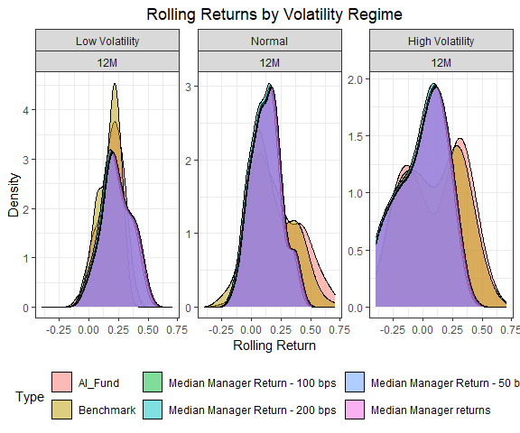
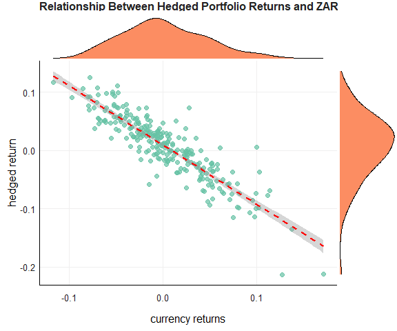
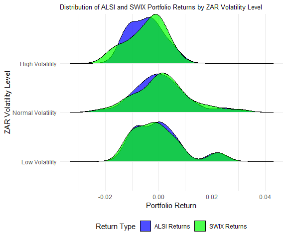

# Financial Econometrics 871 Exam

This document outlines my workflow (Liam Andrew Beattie, Student
No. 22562435) for the Financial Econometrics exam (25-27 November 2024).
The accompanying code/ folder on GitHub contains functions used within
this document.

    ##          used (Mb) gc trigger (Mb) max used (Mb)
    ## Ncells 484082 25.9    1039862 55.6   686457 36.7
    ## Vcells 901972  6.9    8388608 64.0  1876677 14.4

    ## ── Attaching core tidyverse packages ──────────────────────── tidyverse 2.0.0 ──
    ## ✔ dplyr     1.1.4     ✔ readr     2.1.5
    ## ✔ forcats   1.0.0     ✔ stringr   1.5.1
    ## ✔ ggplot2   3.5.1     ✔ tibble    3.2.1
    ## ✔ lubridate 1.9.3     ✔ tidyr     1.3.1
    ## ✔ purrr     1.0.2     
    ## ── Conflicts ────────────────────────────────────────── tidyverse_conflicts() ──
    ## ✖ dplyr::filter() masks stats::filter()
    ## ✖ dplyr::lag()    masks stats::lag()
    ## ℹ Use the conflicted package (<http://conflicted.r-lib.org/>) to force all conflicts to become errors
    ## Loading required package: zoo
    ## 
    ## 
    ## Attaching package: 'zoo'
    ## 
    ## 
    ## The following objects are masked from 'package:base':
    ## 
    ##     as.Date, as.Date.numeric
    ## 
    ## 
    ## Loading required package: xts
    ## 
    ## 
    ## ######################### Warning from 'xts' package ##########################
    ## #                                                                             #
    ## # The dplyr lag() function breaks how base R's lag() function is supposed to  #
    ## # work, which breaks lag(my_xts). Calls to lag(my_xts) that you type or       #
    ## # source() into this session won't work correctly.                            #
    ## #                                                                             #
    ## # Use stats::lag() to make sure you're not using dplyr::lag(), or you can add #
    ## # conflictRules('dplyr', exclude = 'lag') to your .Rprofile to stop           #
    ## # dplyr from breaking base R's lag() function.                                #
    ## #                                                                             #
    ## # Code in packages is not affected. It's protected by R's namespace mechanism #
    ## # Set `options(xts.warn_dplyr_breaks_lag = FALSE)` to suppress this warning.  #
    ## #                                                                             #
    ## ###############################################################################
    ## 
    ## 
    ## Attaching package: 'xts'
    ## 
    ## 
    ## The following objects are masked from 'package:dplyr':
    ## 
    ##     first, last
    ## 
    ## 
    ## Loading required package: treemap

    ## Warning: package 'treemap' was built under R version 4.4.2

    ## Loading required package: PerformanceAnalytics
    ## 
    ## Attaching package: 'PerformanceAnalytics'
    ## 
    ## The following object is masked from 'package:graphics':
    ## 
    ##     legend
    ## 
    ## Loading required package: tbl2xts
    ## Loading required package: ggExtra

    ## Warning: package 'ggExtra' was built under R version 4.4.2

    ## Loading required package: rugarch

    ## Warning: package 'rugarch' was built under R version 4.4.2

    ## Loading required package: parallel
    ## 
    ## Attaching package: 'rugarch'
    ## 
    ## The following object is masked from 'package:purrr':
    ## 
    ##     reduce
    ## 
    ## The following object is masked from 'package:stats':
    ## 
    ##     sigma
    ## 
    ## Loading required package: ggridges

    ## Warning: package 'ggridges' was built under R version 4.4.2

    ## Loading required package: rmgarch

    ## Warning: package 'rmgarch' was built under R version 4.4.2

    ## 
    ## Attaching package: 'rmgarch'
    ## 
    ## The following objects are masked from 'package:xts':
    ## 
    ##     first, last
    ## 
    ## The following objects are masked from 'package:dplyr':
    ## 
    ##     first, last
    ## 
    ## Loading required package: scales
    ## 
    ## Attaching package: 'scales'
    ## 
    ## The following object is masked from 'package:purrr':
    ## 
    ##     discard
    ## 
    ## The following object is masked from 'package:readr':
    ## 
    ##     col_factor

# Question 1

This code chunk performs a series of data wrangling steps for analyzing
financial returns and volatility. First, it extracts data for the median
manager between June 2005 and August 2023 using the
get_median_manager_data function. This function filters active managers
from the ASISA data and identifies the manager whose return is closest
to the global median return. Next, it adjusts the returns for the median
manager by applying different fee levels (50, 100, and 200 basis points)
using get_fee_adjusted_returns, which internally calls
calculate_fee_adjusted_returns to adjust the returns for each fee level.
The rolling returns for both the AI Fund and Benchmark are then computed
using the combine_rolling_returns function, which combines rolling
returns for different assets using the specified window sizes (12, 24,
36 months). Lastly, the rolling volatility for the benchmark returns is
calculated using the calculate_rolling_volatility function and
classified into different volatility regimes with the
stratify_volatility_regimes function. This results in a series of data
transformations that prepare the data for further analysis or plotting.

``` r
# Median Manager Data
ASISA_median <- get_median_manager_data(ASISA, "2005-06-01", "2023-08-31")

# Fee-Adjusted Returns
median_manager_fees <- get_fee_adjusted_returns(ASISA_median, "Returns", c(50, 100, 200))

# Combined Rolling Returns
combined_rolling <- combine_rolling_returns(AI_Fund, BM, median_manager_fees, c(12, 24, 36))
```

The code chunk plot_rolling_returns is used to generate a line plot
comparing the rolling returns for different types of assets or funds, as
stored in the combined_rolling dataset. The plot_rolling_returns
function filters out any NA values from the rolling returns and then
creates a plot using ggplot2.

``` r
# Plots
plot_rolling_returns(combined_rolling)
```


The plot_density function creates density plots to visualize the
distribution of rolling returns for different types of assets or funds.
It filters out any NA values in the rolling_return column, and then uses
ggplot2 to plot the density of rolling_return on the x-axis, with
different fills for each Type (e.g., AI Fund, Benchmark). The plot is
faceted by the Period (such as 12-month, 24-month, etc.) to compare the
distributions across different time windows.

``` r
plot_density(combined_rolling)
```


The next chunks calculates the rolling volatility of benchmark returns
using a 20-day window with the calculate_rolling_volatility function,
which computes the standard deviation of returns over this period. The
volatility values are classified into different regimes (e.g., “Low
Volatility,” “Normal,” and “High Volatility”) using the
stratify_volatility_regimes function. The benchmark volatility data is
then merged with the rolling returns data (combined_rolling) based on
the date column. The Volatility_Regime column is converted to an ordered
factor for easy plotting. Finally, the plot_returns_by_volatility
function generates a density plot of rolling returns by volatility
regime, focusing on the “12M” period and different asset types, allowing
a comparison of returns across volatility regimes.

``` r
# Calculate rolling volatility for the benchmark returns using a 20-day window
BM_volatility <- calculate_rolling_volatility(BM$Returns, BM$date, window_size = 20) %>%
    # Classify the rolling volatility into different regimes 
    mutate(Volatility_Regime = stratify_volatility_regimes(Rolling_Volatility))


# Combine the rolling returns data with the benchmark's volatility regimes
combined_with_volatility <- combined_rolling %>%
    left_join(BM_volatility %>% select(date, Volatility_Regime), by = "date") %>%
    # Convert the Volatility_Regime column into a factor with ordered levels
    mutate(Volatility_Regime = factor(Volatility_Regime, 
                                      levels = c("Low Volatility", "Normal", "High Volatility")))
plot_returns_by_volatility(combined_with_volatility)
```



# Question 2

The following chunk transforms financial data to calculate portfolio
returns, including currency adjustments. First, it reshapes the Indexes
data into a tidy format using pivot_longer, then appends data from Zar
and computes monthly currency returns using the
calculate_currency_returns function, which calculates the logarithmic
returns for the USD/ZAR exchange rate. The currency returns are
converted into a tidy format by convert_currency_returns_to_tidy. Next,
portfolio returns are calculated by calculate_portfolio_returns, where
the portfolio is composed of both hedged (adjusted for currency returns)
and unhedged returns based on predefined weights for different asset
classes (MSCI ACWI, Bbg Agg, J433, ALBI). The final dataset contains
portfolio returns and the associated tickers, with the relevant
adjustments for currency hedging, and is organized by date and ticker.

``` r
tidy_data <- Indexes %>%
    pivot_longer(cols = -date, names_to = "Tickers", values_to = "value") %>%
    bind_rows(Zar) %>%
    arrange(date, Tickers) %>%
    # Calculate monthly currency returns and convert to tidy format in-line
    bind_rows(
        convert_currency_returns_to_tidy(
            calculate_currency_returns(., "$ZAR.USD")
        )
    ) %>%
    # Define weights for portfolio
    bind_rows(
        calculate_portfolio_returns(
            .,
            calculate_currency_returns(., "$ZAR.USD"),
            tibble(
                Tickers = c("MSCI_ACWI", "Bbg_Agg", "J433", "ALBI"),
                weight = c(0.18, 0.12, 0.42, 0.28)  # 70% local, 30% global split
            )
        )
    ) %>%
    select(date, Tickers, value)  # Keep original tidy_data columns
```

The next chunk generates scatter plot a to visualize the relationships
between portfolio returns and currency returns (USD/ZAR). The main
function, plot_portfolio_relationships, creates two scatter plots—one
for unhedged portfolio returns and one for hedged returns. For both, it
first filters the data to select the relevant variables (unhedged_return
or hedged_return and currency_returns), pivots the data into a wider
format, and removes any missing values. Then, it uses the helper
function create_scatter_plot_with_marginals to generate scatter plots
with a trend line (fitted using linear regression) and marginal density
plots for both axes.

``` r
plot_portfolio_relationships(tidy_data, "hedged_return", "currency_returns")
```



The following chunk uses calculate_metrics to compute key financial
metrics for selected portfolio variables (hedged and unhedged returns)
against a reference variable (USD/ZAR exchange rate). It calculates the
correlation, annual return, and annualized standard deviation for each
variable. The function filters the data starting from a specified date,
merges it with reference data, and computes the metrics.

``` r
calculate_metrics(
  data = tidy_data,
  start_date = "2004-12-01",
  row_variables = c("hedged_return", "unhedged_return"),
  reference_variable = "$ZAR.USD"
)
```

    ## # A tibble: 2 × 4
    ##   Tickers         Correlation with $ZAR.U…¹ `Annual Return` `Standard Deviation`
    ##   <chr>                               <dbl>           <dbl>                <dbl>
    ## 1 Hedged Return                      -0.100          0.0516               0.188 
    ## 2 Unhedged Return                    -0.116          0.0988               0.0991
    ## # ℹ abbreviated name: ¹​`Correlation with $ZAR.USD`

# Question 3

In the following chunk, the function
plot_portfolio_returns_by_volatility is used to visualize the
distribution of portfolio returns by volatility level. First, the Zar
data is filtered to align with the ALSI dataset, and the
categorize_currency function is called to categorize volatility levels
based on rolling statistics (mean and standard deviation) over a 12-day
window. The volatility levels are classified into “Low Volatility,”
“Normal Volatility,” and “High Volatility” based on the rolling standard
deviation. Next, the compute_returns function calculates the portfolio
returns for two portfolios, ALSI (using the J203 column for weights) and
SWIX (using the J403 column). This function converts portfolio weights
into a time series format and computes returns using the
Safe_Return.portfolio method. The portfolio returns are then merged with
the volatility categories from the Zar data, and a new Portfolio_Type
column is added to distinguish between ALSI and SWIX returns. Finally, a
ridgeline plot iscreated using ggplot2, which shows the distribution of
portfolio returns for each portfolio type, categorized by volatility
levels.

``` r
plot_portfolio_returns_by_volatility(ALSI, Zar, compute_returns)
```



The following chunk works generates a plot that shows the mean returns
of the ALSI and SWIX portfolios, categorized by market capitalization
(small, medium, and large caps), over time, starting from a specified
start date. The function plot_mean_returns_by_cap_size begins by
preparing the data, where it extracts the portfolio weights for ALSI and
SWIX, specifically filtering by market cap size (small, medium, and
large). It then computes the returns for each portfolio and cap size
using the compute_returns function, which dynamically processes the
weight and return data for each segment. The function combines these
returns into a single dataset, where each entry includes the portfolio
type (ALSI or SWIX) and cap size. The data is grouped by date, index,
and cap size to calculate the mean return for each group. Finally, the
mean returns are plotted using ggplot2.

``` r
ALSI %>% filter(!is.na(Index_Name)) %>% plot_mean_returns_by_cap_size(start_date = "2020-06-01")
```


The following chunk works largely in the same manor as the one previous,
but with sector categories rather than market capitalization.

``` r
ALSI %>% filter(!is.na(Sector)) %>% plot_mean_returns_by_sector(start_date = "2020-06-01")
```


This chunk generates a plot showing the sector exposure of the ALSI
portfolio over time. The function plot_sector_exposure_over_time groups
the ALSI data by date and sector, then sums the portfolio weights (using
columns J203 for ALSI and J403 for SWIX). It reshapes the data into a
long format and creates an area chart using ggplot2, where the y-axis
represents the proportion of the portfolio allocated to each sector. The
plot is faceted by ALSI and SWIX, with sectors colour-coded for clarity,
displaying sector exposure over time.

``` r
ALSI %>%  plot_sector_exposure_over_time()
```


The last two functions called on the analyze_capped_indexes function
that evaluates the impact of capping on portfolio weights by applying
specified weight caps (e.g., 5% and 10%) to assets in the ALSI dataset.
It first filters the ALSI data based on rebalancing dates from RebDays.
Then, for each cap level, it applies the apply_capping funtcion to
adjust weights. The apply_capping function identifies assets whose
weight exceeds the specified cap and then reallocates the weights: it
sets the weight of “Breachers” (assets exceeding the cap) to the cap
value, and proportionally redistributes the remaining weight among the
non-Breachers. This process ensures that the total weight remains equal
to 1, and no asset exceeds the specified cap. After applying the caps,
the function computes the returns for each adjusted portfolio using
compute_returns. Finally, it visualizes the capped returns using the
plot_capped_returns function, comparing the returns at different cap
levels to those of an uncapped portfolio.

``` r
analyze_capped_indexes(ALSI, RebDays, column = "J403", caps = c(0.05, 0.10))
```


``` r
analyze_capped_indexes(ALSI, RebDays, column = "J203", caps = c(0.05, 0.10))
```


# Question 4

In the following chunk, I first merge and prepare the returns data for
both the portfolio (Port_Rets) and the benchmark (BM_Rets) using the
merge_and_prepare_returns_data function. This function renames the
returns column in the portfolio data, merges the portfolio and benchmark
data by date, and retains only the relevant columns. Next, I convert the
merged data into a time-series format (xts) using the
convert_returns_data_to_xts function. This allows for time-based
calculations. I then compute the active returns (the excess returns of
the portfolio over the benchmark) using the compute_active_returns
function. Following this, I calculate two rolling metrics using
rollapply: the rolling tracking error (using a window of 12 periods)
with the calculate_rolling_tracking_error function, and the rolling
downside deviation using the calculate_rolling_downside_deviation
function. Finally, I combine these rolling metrics into a tidy data
frame using the create_tidy_data_for_plotting function, which formats
the data for easy plotting by creating separate columns for the date,
the metric labels, and their corresponding values

This chunk uses the plot_tidy_data_over_time function to plot the
rolling metrics (tracking error and downside risk) over time. It takes
the tidy_data and creates a time-series line plot using ggplot2. THe
function checks for the required columns, then plots the data with
customized labels, colors, and line types. It also adjusts the axis
labels and positions the legend for better clarity.

``` r
tidy_data %>% plot_tidy_data_over_time(title = "Tracking Error and Downside Risk Over Time")
```


This chunk first used merge_and_prepare_returns_data that merges
portfolio and benchmark return data, renaming the portfolio return
column to “Fund” and the benchmark return column to “BM”. It then
selects the relevant columns (date, Fund, and BM) for further analysis.
THis is piped into chart.CumReturns to plot the cumulative returns of
the fund versus the benchmark.

``` r
merge_and_prepare_returns_data(Port_Rets, BM_Rets) %>%  
chart.CumReturns(
  
  wealth.index = TRUE,  # Display returns as a wealth index
  legend.loc = "topleft",  # Place legend on the top left
  main = "Cumulative Returns: Fund vs. Benchmark",
  colorset = c("blue", "red")
)
```


This chunk calls the create_treemap function to generate a treemap
visualization of the portfolio’s sector composition. The function first
merges the portfolio data (Port_Holds) with the benchmark data
(BM_Holds) based on the tickers, for the specified date (or the most
recent date if none is provided). It handles missing sector and stock
names by replacing them with default values (“Unknown” for sectors and
tickers for names). The top N stocks by weight are selected and labelled
with their full names, while others are labelled by there ticker
symbols. The treemap is then created using the treemap package, where
the box size is proportional to the stock’s weight in the portfolio, and
the colour is based on the sector.

``` r
create_treemap(Port_Holds, BM_Holds, N = 0)
```


This chunk calls the create_sector_area_graph function to generate a
stacked area graph illustrating the sector composition of the portfolio
over time. The function begins by merging the portfolio data
(Port_Holds) with benchmark data (BM_Holds) to include sector
information for each stock. Missing sector information is handled by
assigning the label “Unknown” where necessary.

Next, it calculates the total weight of each sector for each date and
then computes the percentage composition of each sector by dividing the
total weight by the sum of all sectors for that date. The data is
grouped by date and sector to ensure proper calculation of these
metrics. The graph is then created using ggplot2’s geom_area function to
generate the stacked area plot, with sector percentages on the y-axis.
Custom colours are applied based on sector, and the plot is formatted
with labels, and title.

``` r
create_sector_area_graph(Port_Holds, BM_Holds)
```


``` r
create_treemap(Port_Holds, BM_Holds, N = 0,date=as.Date("31/01/2020", format = "%d/%m/%Y"))
```


# Question 5

``` r
rm(list = ls())

list.files('Questions/Question 5/code/', full.names = T, recursive = T) %>% .[grepl('.R', .)] %>% as.list() %>% walk(~source(.))
cncy <- read_rds("data/currencies.rds")
cncy_Carry <- read_rds("data/cncy_Carry.rds")
cncy_value <- read_rds("data/cncy_value.rds")
cncyIV <- read_rds("data/cncyIV.rds")
bbdxy <- read_rds("data/bbdxy.rds")
IV <- read_rds("data/IV.rds")
```

In the following chunk I filter data perform transformations on the rand
to calculate its log returns as well as squared logged returns. I then
convert the dataset time-series format (xts) for GARCH modelling. After
which I fit fit a GARCH model to estimate conditional volatility. And
finally I pipe this to a plot function that shows comparisons between
the squared returns and GARCH volatility estimates.

``` r
# Prepare data for -sigZAR, including log returns in the result
zar_data <- cncy %>%
  filter(Name == "SouthAfrica_Cncy") %>%
  arrange(date) %>%
  mutate(log_return = log(Price / lag(Price))) %>%
  drop_na() %>%
  mutate(Squared_Returns = log_return^2)

# Convert to time-series format for GARCH model
zar_xts <- tbl_xts(zar_data, cols_to_xts = "log_return", spread_by = "Name")

# Fit GARCH model and extract conditional volatility
cond_vol_df <- fit_garch(zar_xts)


# Plot comparison
returns_df <- zar_data %>% select(date, Squared_Returns) %>% drop_na()
plot_volatility_comparison(returns_df, cond_vol_df, filter_date = "2010-01-01")
```


In the following chunk, I define a list of selected currencies and then
pass this list along with the cncy dataset to the
fit_garch_for_multiple_currencies() function. This function iterates
through each currency, prepares the time series data, and fits a GARCH
model to estimate conditional volatility. After fitting the GARCH model
for each currency, the volatility estimates are combined into a single
data frame. The result is then passed to the
plot_volatility_across_currencies() function, which plots the volatility
comparisons across all selected currencies. The South African Rand (ZAR)
is highlighted on the plot, with a date filter set to 2015 onwards for
visual comparison.

``` r
# Define currencies
selected_currencies <- c(
  "SouthAfrica_Cncy", "Brazil_Cncy", "Australia_Cncy_Inv", "EU_Cncy_Inv", 
  "Japan_Cncy", "UK_Cncy_Inv", "Canada_Cncy", "Bostwana_Cncy_Inv", "China_Cncy"
)

# Fit GARCH for multiple currencies and pass to plotting funciton 
cncy %>% fit_garch_for_multiple_currencies( selected_currencies) %>% plot_volatility_across_currencies( highlight_currency = "SouthAfrica_Cncy", filter_date = "2015-01-01")
```


In the following chunk, I begin by calculating log returns for both the
South African Rand (ZAR) and the Dollar (BBDXY) using the
calculate_log_returns() function. I then prepare the data for Principal
Component Analysis (PCA) by selecting volatility indices (“V2X”, “VIX”,
“VXEEM”) from the IV dataset and passing them to the prepare_pca_data()
function. PCA is performed on these indices to create a set of
uncorrelated components, and the first principal component (PC1) is
extracted. PC1 captures the dominant factor affecting the volatility
indices, which can be interpreted as a general measure of market
volatility.

Next, I merge the ZAR log returns, Dollar log returns, and the
calculated PC1 values based on the date, allowing me to analyze how the
ZAR and Dollar returns relate to the broader market volatility as
represented by PC1. This merged dataset is then passed into the
fit_dcc_garch() function to fit the DCC-GARCH model, capturing the
conditional volatility dynamics of these series.

Finally, I prepare the data frames for plotting by extracting the
conditional volatility and correlation data from the fitted model. The
plot_dynamic_correlations() function is called to visualize the dynamic
correlations between the ZAR, Dollar, and PC1, highlighting the
relationships between these series over time. The PC1, representing a
composite measure of market volatility, serves as a key explanatory
variable in understanding the ZAR’s behaviour in the context of global
volatility trends.

``` r
# Calculate log returns for ZAR and Dollar
zar_data <- calculate_log_returns(cncy %>% filter(Name == "SouthAfrica_Cncy"))
dollar_data <- calculate_log_returns(bbdxy %>% filter(Name == "BBDXY"))

# Prepare PCA data
pc_data <- prepare_pca_data(IV %>% filter(Name %in% c("V2X", "VIX", "VXEEM")))

# Merge ZAR, Dollar, and PC1 data
merged_data <- zar_data %>%
  select(date, ZAR_log_return = log_return) %>%
  left_join(dollar_data %>% select(date, Dollar_log_return = log_return), by = "date") %>%
  left_join(pc_data %>% select(date, PC1), by = "date") %>%
  drop_na()

# Fit DCC-GARCH model
dcc_fit <- fit_dcc_garch(merged_data)

# Prepare data frames for plotting
volatility_df <- prepare_volatility_df(dcc_fit, merged_data$date)
correlation_df <- prepare_correlation_df(dcc_fit, merged_data$date)

plot_dynamic_correlations(correlation_df)
```


# Question 6
